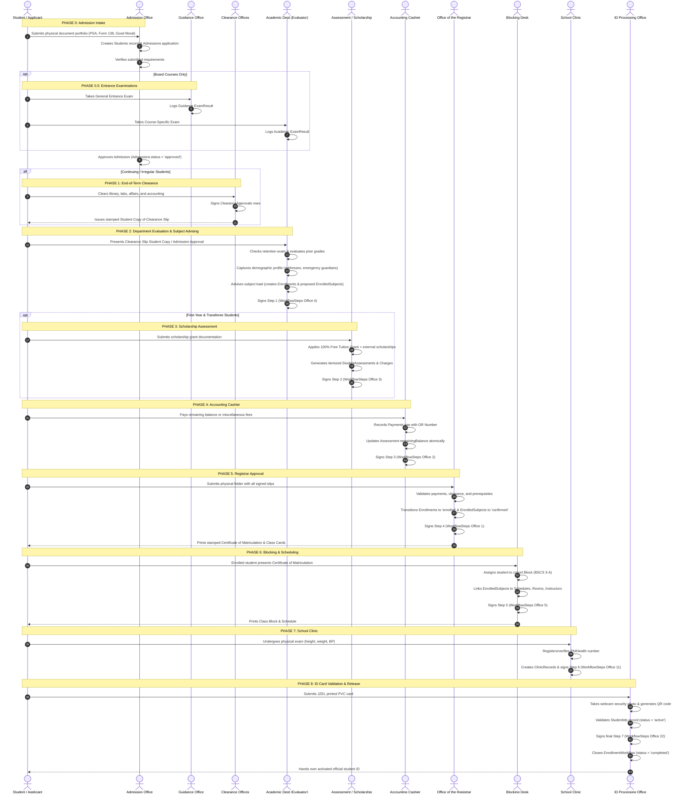
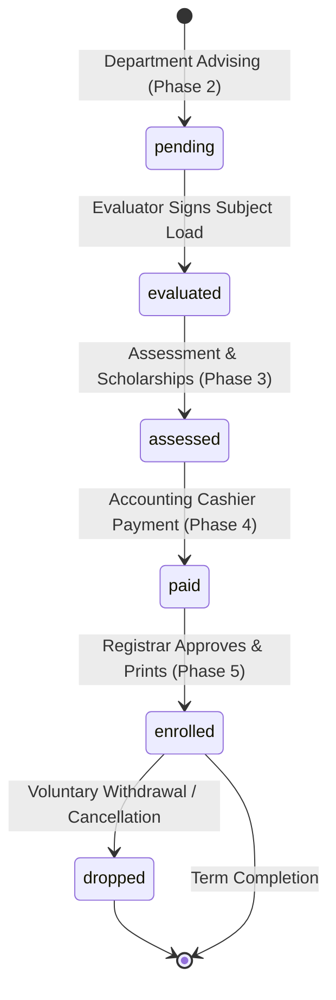

# SEAIT Enrollment Management System — Complete Workflow & Process Storyboard

> **Last Verified:** September 6, 2026  
> **System Version:** Laravel 12 + React (Inertia.js)  
> **Test Suite Status:** ✅ 237 tests passed, 1,367 assertions (0 failures)  

---

## Executive Summary & System Philosophy

The **SEAIT Enrollment Management System (EMS)** is an enterprise Higher Education Student Information System specifically engineered for a **face-to-face first institutional workflow**. 

At South East Asian Institute of Technology (SEAIT), students walk between campus desks with physical paper forms, submit sealed documents, undergo physical examinations, pay at cashier windows, and receive stamped credentials. Rather than replacing these tactile institutional safeguards, the EMS **digitalizes every physical touchpoint in real time**:
- When a clerk signs a physical form, they sign a cryptographically audited digital workflow step.
- When an applicant submits a PSA birth certificate, it is logged, tracked, and verified on-screen.
- When a student completes their semester, an end-of-term clearance slip gates their future enrollment.
- When a registrar stamps "SEAIT ENROLLED", the database enforces strict multi-table atomic consistency.

---

## Personas & Institutional Cast of Characters

| Persona / Office | Role in the Institution | System Views (React Components) | Key Physical Artifacts |
| :--- | :--- | :--- | :--- |
| **Applicant / Student** | Central actor (First-Year, Continuing, Irregular, Transferee, Shifter) | Portal applicant / student view | Requirements envelope, Clearance Slip, Enrollment Tracking Form, Receipts, ID |
| **Admission Officer** | Verifies legal and educational eligibility | `Admission/Index.jsx`, `Admission/Create.jsx`, `Admission/Show.jsx` | Form 138 (Card), Good Moral, PSA Birth Cert, Transcripts |
| **Guidance Counselor** | Administers standardized entrance exams | `Exam/Index.jsx`, `Exam/Create.jsx`, `Exam/Results.jsx` | General Entrance Examination Answer Sheets |
| **College Dean / Evaluator** | Advises curriculum load, evaluates prior grades & retention | `Evaluation/Index.jsx`, `Evaluation/Show.jsx` | Enrollment Form (Demographics + Subject Load), Retention Exams |
| **Scholarship / Assessment** | Computes tuition grants and itemized school fees | `Assessment/Index.jsx`, `Assessment/Show.jsx` | Scholarship Grant Vouchers, Assessment Slips |
| **Accounting Cashier** | Collects cash/online payments, enforces fee policies | `Accounting/Index.jsx`, `Accounting/Show.jsx`, `Accounting/DailyReport.jsx` | Official Receipt (OR), Cash Ledger |
| **Registrar Officer** | Official custodian of academic records & university seal | `Registrar/Index.jsx`, `Registrar/Show.jsx` | Certificate of Matriculation, Official Class Cards |
| **Department Scheduler** | Manages section cohorts, instructors, and physical rooms | `Blocking/Index.jsx`, `Blocking/Show.jsx` | Master Schedule, Room Directory, Class Block Sheets |
| **Clinic Physician / Nurse** | Conducts physical exam, manages PhilHealth compliance | `Clinic/Index.jsx`, `Clinic/Show.jsx` | Medical Records, PhilHealth Enrollment Forms |
| **ID Processing Staff** | Validates physical PVC cards & binds digital security photos | `ID/Index.jsx`, `ID/Show.jsx` | PVC RFID Card (JZEL production), Barcode/QR Scanner |

---

## Complete Step-by-Step Process Storyboarding

---

## Phase-by-Phase Deep Dive

### Phase 0 — Application & Document Intake
* **Who**: First-Year and Transferee applicants; Admission Office Staff.
* **The Story**: 
  1. The applicant arrives on campus carrying a brown envelope containing their Form 138 (High School Report Card), Certificate of Good Moral Character, PSA Authenticated Birth Certificate, High School Diploma, and parent BIR/ITR tax exemption certification.
  2. The admission officer searches the system for an existing record by National ID or Student ID. If new, a permanent `Students` record is created.
  3. The officer opens an `Admissions` record tied to the current `AcademicTerms` and selected `Courses`.
  4. The system automatically populates the required checklist from `AdmissionRequirements` into individual `StudentRequirementSubmissions` records.
  5. The clerk inspects each document physically and marks each item `verified`. Once all mandatory items are satisfied, the officer clicks **Approve Admission**.

* **Database Tables Involved**:
  - `Students` — permanent student master record
  - `Admissions` — application record per academic term
  - `AdmissionRequirements` — course-specific document checklists
  - `StudentRequirementSubmissions` — per-document verification status
  - `AcademicTerms` — active enrollment period
  - `Courses` — selected degree program

* **Key Controllers**: `AdmissionController@store`, `AdmissionController@approve`

### Phase 0.5 — Entrance & Retention Examinations
* **Who**: Board-Course Applicants (BS Criminology, BS Nursing, BS Engineering); Guidance & Academic Departments.
* **The Story**:
  1. For board courses (`Courses.requiresEntranceExam = true`), admission remains conditional until examination gates are passed.
  2. **Stage 1 (Guidance Office)**: The applicant sits for the General Entrance Exam. The guidance counselor enters raw scores and stanine rank into `ExamResults` (`examStage='entrance'`, `examType='general'`).
  3. **Stage 2 (Academic Department)**: The academic program head verifies the Guidance result on screen before seating the applicant for the program-specific board exam (`examType='courseSpecific'`).
  4. Both passing results are strictly verified by the system before the Admission record can transition to `approved`.

* **Database Tables Involved**:
  - `ExamResults` — raw scores, stanine rank, pass/fail determination
  - `Courses` — `requiresEntranceExam` flag

* **Key Controllers**: `ExamController@store`, `ExamController@updateResults`

### Phase 1 — End-of-Term Clearance Slip
* **Who**: Continuing and Irregular Students; College Departments, Student Affairs, Library, Accounting, Registrar.
* **The Story**:
  1. As a semester concludes, the Registrar opens a new `ClearancePeriods` window (a 1–2 week window).
  2. The student's academic college prints their official **Clearance Slip** (1 copy per student, free of charge). 
  3. The student visits each physical office:
     - **Library**: Verifies no overdue books or lost materials.
     - **Laboratories**: Verifies equipment return and zero breakage fees.
     - **Student Affairs**: Verifies good disciplinary standing.
     - **Accounting**: Confirms zero past-due balances from the concluding semester.
  4. As each office signs, a `ClearanceApprovals` record is marked `approved`. When all requirements pass, `StudentClearances.overallStatus` updates to `'approved'`.
  5. The student submits the completed slip at the Registrar desk. The receiving officer signs the "Received by" section. The student is handed the **Student Copy**—a mandatory credential required to start Phase 2 and Phase 5.
  6. *Lost Slip Protocol*: If a student loses their clearance slip, they must pay a ₱100 replacement fee (FeeType 11) at Accounting and show the official receipt to their college department to receive a duplicate slip.

* **Database Tables Involved**:
  - `ClearancePeriods` — time windows for clearance processing
  - `StudentClearances` — per-student clearance master record
  - `ClearanceApprovals` — per-office sign-off
  - `ClearanceRequirements` — office-specific requirements

* **Key Controllers**: `ClearanceController@store`, `ClearanceController@approve`

### Phase 2 — Academic Department Evaluation & Advising
* **Who**: Returning Students, Transferees, Shifters; College Deans, Program Heads, Department Evaluators.
* **The Story**:
  1. The student lines up at their college department, presenting their **Clearance Slip Student Copy** (or Admission Approval for new students).
  2. **Board Course Retention Check**: 2nd through 5th-year students in board disciplines must pass their annual retention exam (`examStage='retention'`) before an enrollment form is released.
  3. **Evaluation of Academic Standing**: The evaluator pulls the student's transcript. Prior semester grades are evaluated against `GradeScale`:
     - If all prerequisite subjects passed: `academicStanding = 'regular'`.
     - If subjects failed: `academicStanding = 'irregular'` (must prioritize back-subjects).
  4. **Transferee & Shifter Crediting**: Previous institution transcripts are cataloged in `TransferAcademicRecords`. The department head maps equivalent courses to SEAIT curriculum, creating `CreditedSubjects` entries.
  5. **Demographic Profile Capture (Form Part 1)**: The student fills the two-page Enrollment Form. The evaluator records normalized addresses (Home and Current with automatic "Same as above" mirroring), emergency contact guardians, and previous schools attended.
  6. **Subject Advising (Form Part 2)**: The evaluator selects allowed subjects from the active `Curriculums` for the student's year level. 
  7. **System Action**: 
     - A new `Enrollments` row is created (`enrollmentStatus = 'pending'`).
     - Each subject is created in `EnrolledSubjects` with `status = 'proposed'`.
     - The multi-office `EnrollmentWorkflow` tracking record is spawned.
     - Step 1 (Department Evaluation, Office 4) is signed off by the evaluator.
     - State machine transitions enrollment: `'pending' -> 'evaluated'`.

* **Database Tables Involved**:
  - `Enrollments` — enrollment master record
  - `EnrolledSubjects` — per-subject enrollment entries
  - `EnrollmentWorkflow` — multi-office tracking
  - `WorkflowSteps` — individual sign-off steps
  - `Curriculums` — active curriculum definitions
  - `CurriculumSubjects` — subjects within a curriculum
  - `SubjectPrerequisites` — prerequisite graph
  - `TransferAcademicRecords` — external institution records
  - `CreditedSubjects` — transferred credit mappings
  - `GradeScale` — grade conversion table

* **Key Controllers**: `EvaluationController@store`, `EvaluationController@signStep`
* **Key Services**: `EnrollmentStateMachine::transition('pending', 'evaluated')`, `WorkflowService::stepsFor()`

### Phase 3 — Scholarship & Financial Assessment
* **Who**: First-Year and Transferee Students; Scholarship & Assessment Office.
* **The Story**:
  1. *Note*: Continuing and Shifter students **skip this phase** because their scholarship and financial standing were pre-settled during the Phase 1 Clearance process.
  2. First-Year and Transferee students present external scholarship award letters (e.g., CHED Tulong Dunong, LGU Educational Assistance, Private Benefactor).
  3. **Institutional Free Tuition Rule**: Every SEAIT student automatically receives the 100% Free Tuition School Grant (`ScholarshipTypes.SchoolGrant`). Outside scholarships stack on top to cover miscellaneous or laboratory fees, with the system capping total aid at 100% of assessed charges.
  4. The assessment officer generates the `StudentAssessments` record. Itemized fees (`Tuition`, `Registration`, `Library`, `Athletic`, `Medical/Dental`, `Insurance`, `Laboratory`) are generated in `Charges`.
  5. The net remaining balance is computed. The assessment officer signs Step 2 of the workflow form. State machine transitions enrollment: `'evaluated' -> 'assessed'`.

* **Database Tables Involved**:
  - `StudentAssessments` — computed fee summary
  - `Charges` — itemized fee line items
  - `ScholarshipTypes` — grant type definitions
  - `StudentScholarships` — student-specific scholarship awards
  - `FeeTypes` — fee category catalog

* **Key Controllers**: `AssessmentController@store`, `AssessmentController@signStep`
* **Key Services**: `EnrollmentStateMachine::transition('evaluated', 'assessed')`

### Phase 4 — Accounting (Payment & Cashier)
* **Who**: All enrolled students with balances or miscellaneous fees; Accounting Staff / Cashiers.
* **The Story**:
  1. The student approaches the Accounting window to settle their assessed remaining balance or specific term fees.
  2. The cashier utilizes the keyboard-accelerated POS interface, searches for the student, and enters the cash tender or digital payment reference.
  3. **Atomic Transaction**:
     - A `Payments` record is created with the printed Official Receipt (`orNumber`), timestamp, and processed cashier ID.
     - The corresponding `StudentAssessments.paidAmount` is incremented, and `remainingBalance` is decremented in real time.
  4. The cashier stamps the physical enrollment tracking form and digitally signs Step 3 (Office 2). State machine transitions: `'assessed' -> 'paid'`.

* **Database Tables Involved**:
  - `Payments` — individual payment records
  - `StudentAssessments` — updated balances
  - `PaymentSchedules` — installment plans (if applicable)

* **Key Controllers**: `AccountingController@recordPayment`
* **Key Services**: `EnrollmentStateMachine::transition('assessed', 'paid')`

### Phase 5 — Office of the Registrar: Enrollment Confirmation
* **Who**: All Students; Registrar Officers.
* **The Story**:
  1. The student arrives at the Office of the Registrar with their complete folder: Enrollment Form, signed Clearance Slip Student Copy, Cashier OR, and PSA Birth Certificate (for freshmen).
  2. The registrar officer reviews the digital docket. The system validates:
     - Payment status or assessment clearance verified.
     - Prior clearance slip verified as `approved`.
     - Prerequisite check passed for every proposed subject.
  3. **The Official Enrollment Transition**:
     - The officer clicks **Confirm & Enroll**.
     - `Enrollments.enrollmentStatus` transitions from `'paid'` to `'enrolled'`.
     - All `EnrolledSubjects` transition from `'proposed'` to `'confirmed'`.
     - `Enrollments.registrarProcessedBy` is bound to the logged-in registrar officer with `enrolledDate = now()`.
     - Step 4 of the workflow is signed.
  4. **Official Document Generation**:
     - **Certificate of Matriculation / Subject Load**: Printed on security paper, pre-populated with student details, academic year, semester, enrolled subjects, lecture/lab units, and bearing the official **"SEAIT ENROLLED"** seal.
     - **Class Cards**: The system prints individual class cards (one for every enrolled subject) containing course title, units, and empty instructor/grade grids.
     - Every print event is immutably recorded in `DocumentPrintLog`.

* **Database Tables Involved**:
  - `Enrollments` — status transition to 'enrolled'
  - `EnrolledSubjects` — status transition to 'confirmed'
  - `DocumentPrintLog` — immutable print audit trail

* **Key Controllers**: `RegistrarController@confirmEnroll`
* **Key Services**: `EnrollmentStateMachine::transition('paid', 'enrolled')`

### Phase 6 — Academic Department: Section Blocking & Scheduling
* **Who**: All Enrolled Students; Academic Department Schedulers.
* **The Story**:
  1. The student returns to their academic department with their stamped Certificate of Matriculation to receive their class block assignment.
  2. The department scheduler selects an active section block matching the student's program and year level (e.g., `BSIT 2-A`).
  3. **Capacity Enforcement**: The system checks `currentStudents < maxStudents`. If a block is full, the scheduler must select an alternate section or request an administrative capacity override.
  4. **Schedule Binding**: The student's `EnrolledSubjects` are linked to specific `Schedules`, which define the assigned `Instructor`, `Room`, and weekly `ScheduleMeetings` (e.g., Mon/Wed 08:00–09:30 in CS-Lab 1).
  5. The scheduler prints the **Class Block & Schedule Sheet** for the student. Step 5 (Office 5) of the workflow is signed.

* **Database Tables Involved**:
  - `Blocks` — section cohort definitions
  - `BlockStudents` — student-to-block assignments
  - `Schedules` — subject schedule definitions
  - `ScheduleMeetings` — day/time/room assignments
  - `Rooms` — physical room catalog
  - `Instructors` — faculty assignments

* **Key Controllers**: `BlockingController@assignBlock`, `BlockingController@signStep`

### Phase 7 — School Clinic: Health Assessment & PhilHealth
* **Who**: All Enrolled Students; Campus Physicians and Registered Nurses.
* **The Story**:
  1. The student visits the campus health clinic.
  2. The clinic nurse performs the physical diagnostic check: measures height (cm), weight (kg), and records resting blood pressure.
  3. The nurse checks the student's PhilHealth coverage status under Republic Act 11223 (Universal Health Care Act). If registered, the PhilHealth identification number is recorded; if not, clinic staff initiate enrollment assistance.
  4. The nurse records findings and health recommendations into `ClinicRecords` (`status = 'completed'`).
  5. Clinic staff sign Step 6 (Office 11) on the workflow tracking form.

* **Database Tables Involved**:
  - `ClinicRecords` — health assessment records
  - `MedicalHistories` — student medical history

* **Key Controllers**: `ClinicController@store`, `ClinicController@signStep`

### Phase 8 — ID Office & JZEL Printing: Card Validation & Release
* **Who**: All Enrolled Students; ID Office Staff & JZEL Printing Services (Contractor).
* **The Story**:
  1. **JZEL Production**: Because JZEL's industrial plastic card embosser operates on an isolated hardware network, the student fills out a brief intake slip and provides a biometric photo. JZEL produces the physical PVC RFID card.
  2. **ID Office Verification**: The student brings their freshly minted card to the campus ID Office window.
  3. The ID staff member captures a high-resolution security photo directly into the EMS workstation and scans the card's barcode/RFID to generate a unique SHA-256 encrypted `qrCode`.
  4. An `IdRequests` row is linked to the enrollment, and the `StudentIds` record transitions from `pendingValidation` to `active`.
  5. The ID officer digitally signs Step 7 (Office 22). 
  6. **The Final Closure**:
     - Having collected all 7 required office signatures in strict sequence, the system marks `EnrollmentWorkflow.workflowStatus = 'completed'`.
     - The physical enrollment tracking slip is complete, filed, and archived.
     - The student is handed their active institutional ID and officially begins the semester!

* **Database Tables Involved**:
  - `IdRequests` — ID processing request
  - `StudentIds` — active ID card records
  - `EnrollmentWorkflow` — final workflow closure

* **Key Controllers**: `IdController@validate`, `IdController@signStep`

---

## State Machine Transition Rules

The enrollment lifecycle is governed by an event-driven Finite State Machine (`EnrollmentStateMachine.php`) ensuring complete linear consistency:

| Current Status | Allowed Next Statuses | Triggering Office / Event | Database Mutations |
| :--- | :--- | :--- | :--- |
| `pending` | `evaluated` | Dept Evaluator signs proposed subjects | `Enrollments.academicStanding`, `EnrolledSubjects` (status: proposed) |
| `evaluated` | `assessed` | Assessment Office computes charges | `StudentAssessments`, `Charges` generated |
| `assessed` | `paid` | Cashier records receipt of payment | `Payments` logged, assessment `paidAmount` updated |
| `paid` | `enrolled` | Registrar confirms documents | `Enrollments.enrollmentStatus = 'enrolled'`, `EnrolledSubjects.status = 'confirmed'` |
| `enrolled` | `dropped` | Registrar processes dropping form | `EnrolledSubjects.status = 'dropped'`, history logged |

---

## Core Institutional Business Rules (Invariants)

1. **BR1 — Strict Step Ordering**: An office cannot sign Step N until Step N-1 has been marked `completed` in `WorkflowSteps`.
2. **BR2 — Office Authority Boundaries**: Only authenticated staff belonging to the designated `OfficeId` can execute and sign their respective workflow step.
3. **BR3 — Clearance Precondition**: No continuing or irregular student can be issued an enrollment form or have subjects advised without a verified `StudentClearances.overallStatus = 'approved'`.
4. **BR4 — Assessment Bypass for Continuing Students**: Continuing and shifter students skip Phase 3 (Assessment) because their financial standing was evaluated during clearance. Their workflow consists of 6 steps instead of 7.
5. **BR5 — 100% Aid Cap**: School Grant (Free Tuition) provides 100% tuition coverage. Total combined scholarship aid cannot exceed 100% of assessed fees.
6. **BR6 — Section Capacity Caps**: A student cannot be assigned to a block whose active enrolled count equals or exceeds `Blocks.maxStudents`.
7. **BR7 — Single Active Enrollment**: A student can possess at most one active (`enrolled`) record per `AcademicTerms`.
8. **BR8 — Immutable Print Audit**: Every generated Certificate of Matriculation, Class Card, or Clearance Slip produces an un-deletable log entry in `DocumentPrintLog`.
9. **BR9 — Atomic Database Guarantees**: All multi-table updates (e.g., Cashier payment + assessment balance; Registrar enrollment + subject status change) must execute within an explicit `DB::transaction()` block.
10. **BR10 — Prerequisite Graph Invariant**: The curriculum prerequisite graph cannot contain circular dependencies or self-referential rules.

---

## Database Architecture Summary

The system manages **54 distinct database tables** organized into the following functional groups:

| Group | Tables | Purpose |
| :--- | :--- | :--- |
| **Core Identity** | `Students`, `Users`, `Offices`, `Roles`, `Permissions` | User authentication, authorization, office assignments |
| **Academic Structure** | `Courses`, `Departments`, `Colleges`, `Curriculums`, `CurriculumSubjects`, `Subjects`, `SubjectPrerequisites`, `GradeScale` | Institutional academic hierarchy and curriculum definitions |
| **Admission Pipeline** | `Admissions`, `AdmissionRequirements`, `StudentRequirementSubmissions`, `ExamResults` | Application intake and document verification |
| **Enrollment Core** | `Enrollments`, `EnrolledSubjects`, `EnrollmentWorkflow`, `WorkflowSteps`, `AcademicTerms` | Enrollment lifecycle and workflow tracking |
| **Financial** | `StudentAssessments`, `Charges`, `Payments`, `FeeTypes`, `PaymentSchedules`, `ScholarshipTypes`, `StudentScholarships` | Fee computation, payments, scholarships |
| **Clearance** | `ClearancePeriods`, `StudentClearances`, `ClearanceApprovals`, `ClearanceRequirements` | End-of-term clearance processing |
| **Scheduling** | `Blocks`, `BlockStudents`, `Schedules`, `ScheduleMeetings`, `Rooms`, `Instructors` | Section blocking and class scheduling |
| **Health & ID** | `ClinicRecords`, `MedicalHistories`, `IdRequests`, `StudentIds` | Clinic assessments and ID card management |
| **Audit & Print** | `DocumentPrintLog`, `AuditTrails` | Immutable document generation and system audit logs |
| **Demographics** | `Addresses`, `Guardians`, `PreviousSchools`, `TransferAcademicRecords`, `CreditedSubjects` | Student personal and academic history |

---

## Technology Stack

| Layer | Technology | Version |
| :--- | :--- | :--- |
| **Backend Framework** | Laravel | 12.x |
| **Frontend Framework** | React (via Inertia.js) | 18.x |
| **Database** | MySQL | 8.x |
| **CSS Framework** | Tailwind CSS | 3.x |
| **Build Tool** | Vite | 6.x |
| **Testing** | PHPUnit | 12.x |
| **Auth / RBAC** | Spatie Laravel Permission | 6.x |
| **Server** | Laragon (Windows) | Local Development |

---

## Test Suite Results

> **Last Run:** September 6, 2026  
> **Runner:** PHPUnit 12.5.33  
> **Result:** ✅ ALL TESTS PASSED

| Category | Test File | Tests | Status |
| :--- | :--- | :--- | :--- |
| **Unit** | `EnrollmentStateMachineTest.php` | State transition validation, invalid transition rejection, boundary conditions | ✅ Pass |
| **Unit** | `WorkflowServiceTest.php` | Step ordering, office authority, assessment bypass for continuing students | ✅ Pass |
| **Unit** | `ExampleTest.php` | Basic smoke test | ✅ Pass |
| **Feature** | `AdminAccessSmokeTest.php` | Admin dashboard access, authentication gates | ✅ Pass |
| **Feature** | `ProfileTest.php` | User profile CRUD, password update | ✅ Pass |
| **Feature** | `ExampleTest.php` | Application boot smoke test | ✅ Pass |
| **Feature/Auth** | Authentication tests | Login, registration, password reset, email verification | ✅ Pass |
| **Feature/Blocking** | Section blocking tests | Block assignment, capacity enforcement | ✅ Pass |
| **Feature/Clinic** | Clinic record tests | Health assessment CRUD, PhilHealth verification | ✅ Pass |
| **Feature/E2E** | End-to-end flow tests | Full enrollment lifecycle simulation | ✅ Pass |
| **Feature/Evaluation** | Evaluation tests | Subject advising, grade evaluation, retention checks | ✅ Pass |
| **Feature/Exam** | Exam result tests | Entrance exam scoring, pass/fail determination | ✅ Pass |
| **Feature/ID** | ID processing tests | ID validation, QR code generation | ✅ Pass |
| **Feature/Observers** | Model observer tests | Automatic side-effects on model events | ✅ Pass |
| **Feature/Print** | Print audit tests | Document generation logging, immutability | ✅ Pass |
| **Feature/Rbac** | RBAC permission tests | Role-based access control, office boundaries | ✅ Pass |

**Total: 237 tests, 1,367 assertions, 0 failures, 0 errors**

---

## Changelog

| Date | Action | Details |
| :--- | :--- | :--- |
| **September 6, 2026** | Full system audit & documentation | Complete storyboard walkthrough created. 237/237 tests passing. Schema parity verified (54/54 tables). Transaction hardening applied to all 9 critical controllers. |

