# Use Case Diagram Architecture & Modeling Guide
## SEAIT Enrollment Management System (EMS)

> **Document Type:** Systems Engineering & UML Modeling Standard  
> **Target Audience:** Systems Analysts, Software Architects, Academic Evaluators, Capstone Reviewers, Developers  
> **System Scope:** South East Asian Institute of Technology (SEAIT) Enrollment Management System  
> **Specification Standard:** UML 2.5 compliant notation with strict **Action-Verb Format**  
> **Source of Truth:** Verified against routes (`routes/web.php`, `routes/auth.php`), Eloquent models (`app/Models/**`), RBAC permissions (`database/seeders/RbacSeeder.php`), and controller methods (`app/Http/Controllers/**`).
>
> **Status update (2026-09-24):** the counts in this guide were verified at commit `c8ea184`. The live app now serves **166 HTTP routes** and the RBAC layer holds **17 roles** (14 functional desk roles + OfficeHead, Staff, Instructor). Desk 10 is now the **Student ID Hub** — an ID requests flow (request → photo upload → validate → release; no PVC/QR production). The use case names and methodology below remain current.

---

## Table of Contents

1. [Executive Overview & Purpose](#1-executive-overview--purpose)
2. [The Definitive Guide to Use Case Modeling](#2-the-definitive-guide-to-use-case-modeling)
   - [2.1 What is a Use Case Diagram?](#21-what-is-a-use-case-diagram)
   - [2.2 Core UML Elements & Visual Notation](#22-core-uml-elements--visual-notation)
   - [2.3 The Mandatory Action-Verb Naming Standard](#23-the-mandatory-action-verb-naming-standard)
   - [2.4 Use Case Relationships: Association, Include, Extend, Generalization](#24-use-case-relationships-association-include-extend-generalization)
   - [2.5 Standardized Action-Verb Dictionary for Academic Systems](#25-standardized-action-verb-dictionary-for-academic-systems)
   - [2.6 Step-by-Step Blueprint for Creating Use Case Diagrams](#26-step-by-step-blueprint-for-creating-use-case-diagrams)
3. [SEAIT EMS Global System Boundary Diagram](#3-seait-ems-global-system-boundary-diagram)
4. [Detailed Subsystem Use Case Diagrams & Specifications](#4-detailed-subsystem-use-case-diagrams--specifications)
   - [Desk 01: Admissions Desk](#desk-01-admissions-desk)
   - [Desk 02: Guidance & Entrance Examination Desk](#desk-02-guidance--entrance-examination-desk)
   - [Desk 03: Academic Evaluation & Department Desk](#desk-03-academic-evaluation--department-desk)
   - [Desk 04: Financial Assessment & Scholarship Desk](#desk-04-financial-assessment--scholarship-desk)
   - [Desk 05: Accounting, Billing & Cashier Desk](#desk-05-accounting-billing--cashier-desk)
   - [Desk 06: Student Affairs & Campus Clearance Desk](#desk-06-student-affairs--campus-clearance-desk)
   - [Desk 07: Curriculum Scheduling & Block Assignment Desk](#desk-07-curriculum-scheduling--block-assignment-desk)
   - [Desk 08: Office of the University Registrar Desk](#desk-08-office-of-the-university-registrar-desk)
   - [Desk 09: Campus Health & Medical Clinic Desk](#desk-09-campus-health--medical-clinic-desk)
   - [Desk 10: Student ID Production & Validation Desk](#desk-10-student-id-production--validation-desk)
   - [Desk 11: Student 360° Digital Dossier & Directory Desk](#desk-11-student-360-digital-dossier--directory-desk)
   - [Desk 12: System Administration, Security & Audit Desk](#desk-12-system-administration-security--audit-desk)
5. [Formal Use Case Specifications (Deep-Dive Templates)](#5-formal-use-case-specifications-deep-dive-templates)
   - [Specification 1: UC-ADM-04 (Approve Admission Application)](#specification-1-uc-adm-04-approve-admission-application)
   - [Specification 2: UC-ACC-02 (Post Student Payment Transaction)](#specification-2-uc-acc-02-post-student-payment-transaction)
   - [Specification 3: UC-REG-02 (Approve Final Student Enrollment)](#specification-3-uc-reg-02-approve-final-student-enrollment)
6. [Quality Assurance Checklist & Anti-Patterns to Avoid](#6-quality-assurance-checklist--anti-patterns-to-avoid)

---

## 1. Executive Overview & Purpose

A **Use Case Diagram** is the primary dynamic view of a system's functional architecture within the Unified Modeling Language (UML). It captures **what** the system does from the perspective of external users (actors) without committing to **how** internal software layers, database schemas, or algorithms deliver that functionality.

For the **SEAIT Enrollment Management System (EMS)**, this guide fulfills two vital functions:
1. **Architectural Specification:** Maps the system's operational desks, Spatie RBAC security roles, and their HTTP routes to clear, traceable Use Cases that represent genuine business transactions.
2. **Pedagogical Standard:** Serves as a definitive manual on how to design, construct, and defend industrial-grade Use Case diagrams using the **Action-Verb Format**.

---

## 2. The Definitive Guide to Use Case Modeling

### 2.1 What is a Use Case Diagram?

Under the **UML 2.5 specification**, a Use Case Diagram represents:
- **The System Boundary:** The line separating the software platform from the outside world.
- **Actors:** External entities (human users, external institutional systems, automated daemons) that interact with the system to achieve a measurable goal.
- **Use Cases:** Distinct sequences of actions performed by the system that yield an observable result of measurable value to a specific actor.
- **Relationships:** The behavioral associations (`---`), dependencies (`<<include>>`), optional branches (`<<extend>>`), and inheritance hierarchies (`Generalization`) that connect actors and use cases.

```
+-------------------------------------------------------------+
|                      System Boundary                        |
|                                                             |
|   Actor                   ( Use Case )                      |
|    옷 --------------------( Action-Verb )                   |
|  (User)                         |                           |
|                           <<include>>                       |
|                                 v                           |
|                           ( Use Case 2 )                    |
+-------------------------------------------------------------+
```

---

### 2.2 Core UML Elements & Visual Notation

| Element | Visual Shape | UML Semantics | Example in SEAIT EMS |
| :--- | :--- | :--- | :--- |
| **System Boundary** | Large Rectangle | Defines the boundary of the application. Everything inside is built/managed by the software; everything outside is external. | `SEAIT Enrollment Management System` |
| **Primary Actor** | Stick Figure (Left) | Initiates the interaction to accomplish an institutional goal. | `AdmissionOfficer`, `Cashier` |
| **Secondary Actor** | Stick Figure (Right) | Supports the completion of a use case (e.g., recipient of notifications, external payment gateway). | `Applicant`, `SMS Notification Service` |
| **Use Case** | Horizontal Oval / Stadium | Represents a discrete, measurable unit of business value. | `(Record New Applicant)` |
| **Association** | Solid Line (`---`) | Denotes communication between an actor and a use case. | `AdmissionOfficer --- (Verify Requirement Documents)` |
| **Include Dependency** | Dashed Arrow (`-.->`) with `<<include>>` | Mandatory inclusion. Base use case cannot be completed without executing the included use case. | `(Approve Admission) -.->|<<include>>| (Validate Entrance Exam Status)` |
| **Extend Dependency** | Dashed Arrow (`-.->`) with `<<extend>>` | Optional/conditional behavior triggered only when specific extension point criteria are met. | `(Post Payment) <.-|<<extend>>|- (Issue Installment Promissory Note)` |
| **Generalization** | Solid Arrow with Hollow Triangle (`--\|>`) | Inheritance where a specialized child inherits behaviors and permissions of a parent. | `Dean --\|> DeptEvaluator` |

---

### 2.3 The Mandatory Action-Verb Naming Standard

> [!IMPORTANT]
> **The Golden Rule of Use Case Naming:**  
> Every Use Case name **MUST** begin with an active, transitive verb followed by a specific direct object (noun phrase) and optional business context:
>
> $$\mathbf{Use\ Case\ Name = [Active\ Transitive\ Verb] + [Direct\ Object\ Noun] + [Contextual\ Qualifier]}$$

#### Why Noun-Only Naming Fails
A common defect in student and junior engineering projects is naming use cases with static nouns:
- ❌ *Incorrect:* `Admission`, `Evaluation`, `Tuition Assessment`, `Payment`, `Clearance`, `ID Card`
- **Why this fails:** A noun describes a *thing* or a *data table*, not a *behavior* or *goal*. When a diagram says `Payment`, it does not answer: Is the actor *paying*? *Computing* payment? *Refunding* payment? *Viewing* payment history? Or *auditing* payment voids?

#### Correct Action-Verb Formulation
- ✅ *Correct:* `Submit Admission Application` (Applicant initiates)
- ✅ *Correct:* `Verify Requirement Documents` (Staff validates files)
- ✅ *Correct:* `Approve Admission Application` (Officer commits status change)
- ✅ *Correct:* `Post Student Payment Transaction` (Cashier records cash receipt)
- ✅ *Correct:* `Assess Itemized Tuition Fees` (Assessor computes charges)
- ✅ *Correct:* `Issue Certificate of Matriculation` (Registrar prints official proof)

---

### 2.4 Use Case Relationships: Association, Include, Extend, Generalization

#### 1. Direct Association (`---`)
Indicates bidirectional or actor-initiated communication.
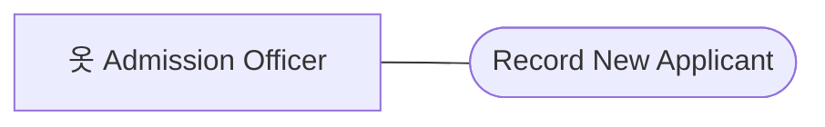

#### 2. The `<<include>>` Relationship (Mandatory Reusability)
- Base use case explicitly incorporates the behavior of the included use case at a specified location.
- **Rule:** The base use case is incomplete without the included use case.
- **Direction of Arrow:** Points **from the base use case TO the included use case**.
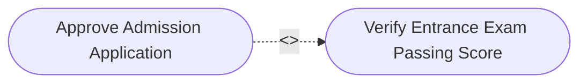

#### 3. The `<<extend>>` Relationship (Conditional Variation)
- Extends the behavior of a base use case conditionally at an **Extension Point**.
- **Rule:** The base use case can execute completely without the extending use case. The extension only runs under defined circumstances.
- **Direction of Arrow:** Points **from the extending use case TO the base use case**.
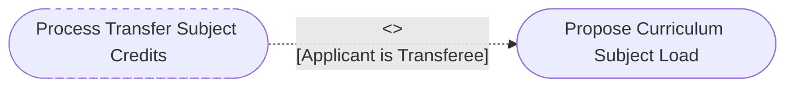

#### 4. Generalization (Actor or Use Case Inheritance)
- Represents "is-a" taxonomy. An actor inherits all associations of its parent.
```mermaid
flowchart BT
    Dean["옷 College Dean"] --|> Evaluator["옷 Department Evaluator"]
    Evaluator --- UC_Propose(["Propose Curriculum Subject Load"])
    Dean --- UC_DeanSign(["Sign Dean Curriculum Override"])
```

---

### 2.5 Standardized Action-Verb Dictionary for Academic Systems

When modeling enterprise ERP and Student Information Systems, use this standardized verb taxonomy:

| Category | Recommended Verbs | Avoid (Ambiguous) | Concrete SEAIT EMS Example |
| :--- | :--- | :--- | :--- |
| **Intake & Creation** | `Record`, `Register`, `Submit`, `Initiate` | `Input`, `Data Entry`, `Create` | `Record New Applicant`, `Initiate Student ID Request` |
| **Validation & Audit** | `Verify`, `Validate`, `Inspect`, `Screen` | `Check`, `Look at`, `View` | `Verify Requirement Documents`, `Screen Physical Vitals` |
| **Commitment & State** | `Approve`, `Reject`, `Finalize`, `Lock`, `Sign` | `Process`, `Handle`, `Manage` | `Approve Admission Application`, `Finalize Financial Assessment` |
| **Computation** | `Compute`, `Recalculate`, `Estimate`, `Adjust` | `Math`, `Calculate`, `Count` | `Compute Itemized Tuition Fees`, `Adjust Individual Fee Charges` |
| **Financial Execution** | `Post`, `Collect`, `Disburse`, `Void` | `Pay`, `Money`, `Bill` | `Post Student Payment Transaction`, `Void Erroneous Payment` |
| **Academic Scheduling** | `Assign`, `Unassign`, `Schedule`, `Override` | `Set`, `Block`, `Put` | `Assign Enrolled Students to Block`, `Schedule Class Room Assignment` |
| **Document Output** | `Generate`, `Print`, `Issue` | `Make`, `Export`, `Get` | `Print Certificate of Matriculation`, `Release ID Card` |
| **Administrative Control**| `Configure`, `Toggle`, `Deactivate`, `Audit` | `Maintain`, `Administer`, `Do` | `Assign Spatie Security Roles`, `Audit Institutional Activity Logs` |

---

### 2.6 Step-by-Step Blueprint for Creating Use Case Diagrams

To model any software system with absolute rigor, execute these six sequential phases:

```
[Phase 1: Identify Boundaries] 
           ↓
[Phase 2: Enumerate Real Actors] 
           ↓
[Phase 3: Elicit Goal-Driven Use Cases (Action-Verb)] 
           ↓
[Phase 4: Map Direct Actor Associations] 
           ↓
[Phase 5: Factor Out <<include>> & <<extend>>] 
           ↓
[Phase 6: Validate Against Routes & RBAC Matrix]
```

1. **Define the System Boundary:** Draw a clear boundary box. External web portals, third-party payment gateways, and human staff remain strictly outside.
2. **Enumerate Genuine Actors:** Identify actors by their operational role (e.g., `AdmissionOfficer`, `Cashier`), not by personal names (`John Doe`). Include secondary actors (e.g., `Applicant`, `External Bank API`).
3. **Draft Goals in Action-Verb Format:** Ask: *"What measurable goal does this actor achieve when sitting at this screen?"* (e.g., `Verify Requirement Documents`).
4. **Draw Association Lines:** Connect actors only to use cases they directly trigger or participate in.
5. **Apply Behavioral Packaging:**
   - If a step is **always mandatory** for multiple use cases, factor it out using `<<include>>`.
   - If a step is **conditional** (e.g., only for Transferees, only when voiding, only on downpayment), connect it using `<<extend>>`.
6. **Cross-Check with State Machines & Authorization Gates:** Verify that every use case corresponds to a valid controller endpoint, policy gate, and data transaction.

---

## 3. SEAIT EMS Global System Boundary Diagram

The diagram below visualizes the **complete enterprise architecture** of the SEAIT Enrollment Management System, showcasing all 12 operational desks and their primary interactions across the institutional lifecycle:

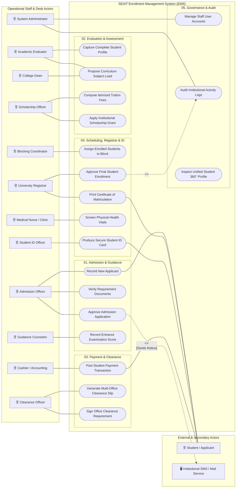

---

## 4. Detailed Subsystem Use Case Diagrams & Specifications

---

### Desk 01: Admissions Desk

The Admissions Desk manages the onboarding of freshmen, transferees, and shifters into the academic pipeline.

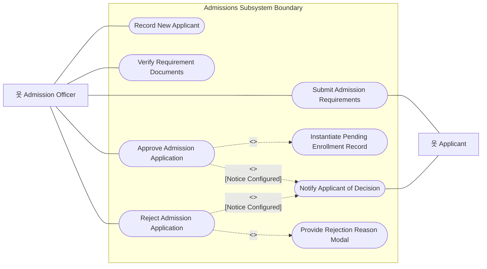

#### Action-Verb Specifications: Admissions Desk

| Use Case ID | Use Case Name (Action-Verb) | Primary Actor | Secondary Actor | Trigger / Goal | Preconditions | Postconditions |
| :--- | :--- | :--- | :--- | :--- | :--- | :--- |
| **UC-ADM-01** | `Record New Applicant` | Admission Officer | Applicant | Walk-in or online intake form submitted | User has `admission.create` permission | `students` and `admissions` records created with status `UnderReview` |
| **UC-ADM-02** | `Submit Admission Requirements` | Admission Officer | Applicant | Physical documents presented | Valid `admissionId` exists | Digital files stored in secure storage; document status set to `Submitted` |
| **UC-ADM-03** | `Verify Requirement Documents` | Admission Officer | None | Officer reviews submitted credentials | Document is in `Submitted` status | Document status updated to `Verified` or `Rejected` |
| **UC-ADM-04** | `Approve Admission Application` | Admission Officer | Applicant | All mandatory requirements verified | Requirements verified, General Exam passed | `admissions.status = Approved`; `enrollments` initialized with `Pending` |
| **UC-ADM-05** | `Reject Admission Application` | Admission Officer | Applicant | Disqualification or unfulfilled criteria | Admission is `UnderReview` | `admissions.status = Rejected`; audit log records rejection cause |

---

### Desk 02: Guidance & Entrance Examination Desk

The Guidance Desk handles psychological, entrance, and retention diagnostic examinations required prior to academic department acceptance.

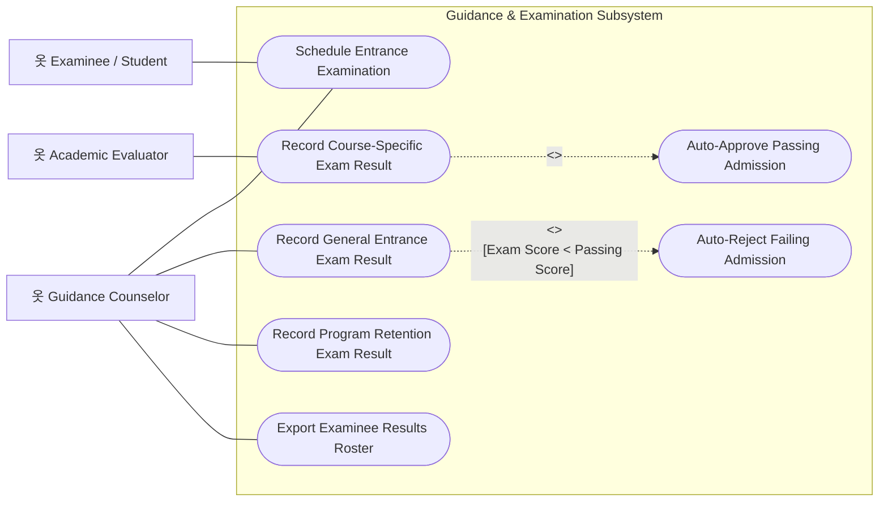

#### Action-Verb Specifications: Guidance Desk

| Use Case ID | Use Case Name (Action-Verb) | Primary Actor | Secondary Actor | Trigger / Goal | Preconditions | Postconditions |
| :--- | :--- | :--- | :--- | :--- | :--- | :--- |
| **UC-EXM-01** | `Schedule Entrance Examination` | Guidance Counselor | Examinee | Applicant completes admission intake | Admission record is active | Exam session assigned with date, room, and test proctor |
| **UC-EXM-02** | `Record General Entrance Exam Result` | Guidance Counselor | None | Exam papers scored | Examinee completed test session | Raw score, percentile, and remarks (`Passed`/`Failed`) recorded |
| **UC-EXM-03** | `Record Course-Specific Exam Result` | Academic Evaluator | Guidance Staff | Board program applicant takes specialized exam | General exam passed (`BR9`) | Course exam score saved; triggers conditional admission auto-approval |
| **UC-EXM-04** | `Record Program Retention Exam Result` | Guidance Counselor | Academic Dean | Continuing student in board program takes annual retention test | Student enrolled in regulated course | Retention score recorded; informs next term eligibility (`BR10`) |
| **UC-EXM-05** | `Export Examinee Results Roster` | Guidance Counselor | None | Periodic reporting or department turnover | Evaluated exam records exist | Formatted PDF/Excel report generated with statistical breakdowns |

---

### Desk 03: Academic Evaluation & Department Desk

The Department Evaluation Desk (Program Heads and Deans) structures student subject loads, evaluates curriculum prerequisites, and credits previous coursework.

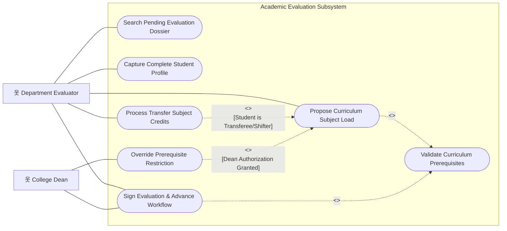

#### Action-Verb Specifications: Academic Evaluation Desk

| Use Case ID | Use Case Name (Action-Verb) | Primary Actor | Secondary Actor | Trigger / Goal | Preconditions | Postconditions |
| :--- | :--- | :--- | :--- | :--- | :--- | :--- |
| **UC-EVA-01** | `Search Pending Evaluation Dossier` | Department Evaluator | None | Student arrives at academic department | Enrollment is in `Pending` status | Dossier displayed with curriculum and historical grades |
| **UC-EVA-02** | `Capture Complete Student Profile` | Department Evaluator | None | Intake profile data incomplete | Evaluation dossier loaded | Full demographic, emergency contact, and guardian records saved |
| **UC-EVA-03** | `Propose Curriculum Subject Load` | Department Evaluator | None | Evaluator selects subjects for current term | Active curriculum assigned | Proposed subjects recorded in `enrolledsubjects` with status `Proposed` |
| **UC-EVA-04** | `Process Transfer Subject Credits` | Department Evaluator | None | Transferee presents official transcript (TOR) | Student type is `Transferee` or `Shifter` | Accredited courses saved in `creditedsubjects`; exempted from load |
| **UC-EVA-05** | `Validate Curriculum Prerequisites` | System / Engine | None | Subject selection submitted | Subject catalog rules active | System blocks unfulfilled prerequisite subjects unless overridden |
| **UC-EVA-06** | `Override Prerequisite Restriction` | College Dean | Department Evaluator | Graduating or special-status student requires waiver | Dean credentials supplied | Prerequisite bypassed with institutional justification audit log |
| **UC-EVA-07** | `Sign Evaluation & Advance Workflow` | Department Evaluator | College Dean | All curriculum subjects validated | No pending prerequisite conflicts | `enrollments.status = Evaluated`; advances to Assessment Desk |

---

### Desk 04: Financial Assessment & Scholarship Desk

The Financial Assessment Desk computes tuition fees, miscellaneous assessments, laboratory costs, and applies institutional and outside scholarships.

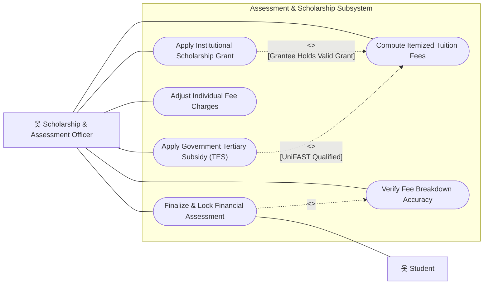

#### Action-Verb Specifications: Assessment Desk

| Use Case ID | Use Case Name (Action-Verb) | Primary Actor | Secondary Actor | Trigger / Goal | Preconditions | Postconditions |
| :--- | :--- | :--- | :--- | :--- | :--- | :--- |
| **UC-ASS-01** | `Compute Itemized Tuition Fees` | Assessment Officer | None | Evaluated student reaches assessment station | Enrollment is in `Evaluated` status | `studentassessments` generated with tuition, lab, and misc fee rows |
| **UC-ASS-02** | `Apply Institutional Scholarship Grant` | Scholarship Officer | Student | Student presents approved scholarship grant | Valid scholarship profile | Scholarship discount credited against tuition; balance updated |
| **UC-ASS-03** | `Apply Government Tertiary Subsidy` | Scholarship Officer | UniFAST | Student certified under RA 10931 / TES | Billing eligibility verified | TES subsidy applied against allowable billing caps (`BR19`) |
| **UC-ASS-04** | `Adjust Individual Fee Charges` | Assessment Officer | None | Special lab or waiver required | Unlocked assessment record | Charge lines edited with audit logging of previous vs new amounts |
| **UC-ASS-05** | `Verify Fee Breakdown Accuracy` | Assessment Officer | Student | Reviewing billing breakdown with student | Assessment computed | Total assessed matches individual line sum exactly (`BR13`) |
| **UC-ASS-06** | `Finalize & Lock Financial Assessment` | Assessment Officer | Student | Student confirms itemized fees | No math discrepancies | `assessmentStatus = Finalized`; enrollment advances to Cashier |

---

### Desk 05: Accounting, Billing & Cashier Desk

The Cashier and Accounting Desk processes tuition payments, issues Official Receipts (OR), and reports collections.

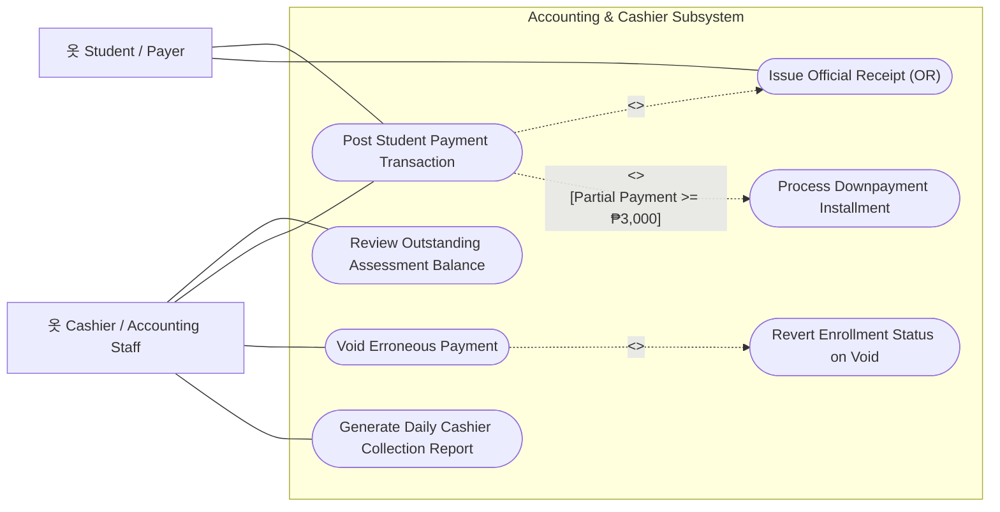

#### Action-Verb Specifications: Accounting Desk

| Use Case ID | Use Case Name (Action-Verb) | Primary Actor | Secondary Actor | Trigger / Goal | Preconditions | Postconditions |
| :--- | :--- | :--- | :--- | :--- | :--- | :--- |
| **UC-ACC-01** | `Review Outstanding Assessment Balance` | Cashier | Student | Student presents assessment form at window | Assessment is finalized | System shows net balance, prior payments, and minimum downpayment |
| **UC-ACC-02** | `Post Student Payment Transaction` | Cashier | Student | Cashier receives payment tender | Valid assessment exists | Payment record created; `remainingBalance` updated; status set to `Paid` |
| **UC-ACC-03** | `Issue Official Receipt (OR)` | Cashier | Student | Payment transaction saved | Payment record created | Official receipt number assigned and printable slip rendered |
| **UC-ACC-04** | `Process Downpayment Installment` | Cashier | Student | Student elects installment plan | Tender >= minimum installment downpayment | Student cleared for registration despite non-zero remaining balance |
| **UC-ACC-05** | `Void Erroneous Payment` | Accounting Staff | None | Accounting supervisor detects data-entry error | Payment is active | Payment marked as `Void`; balance recalculated |
| **UC-ACC-06** | `Revert Enrollment Status on Void` | System / Engine | None | Voiding payment causes positive balance on `Paid` student | Void payment executed | State machine transitions `enrollmentStatus` back to `Assessed` |
| **UC-ACC-07** | `Generate Daily Cashier Collection Report` | Cashier | None | End of business day reconciliation | Daily payments exist | Summary report produced categorized by payment mode and fee types |

---

### Desk 06: Student Affairs & Campus Clearance Desk

The Clearance Desk oversees institutional accountability (library, laboratory, student discipline, athletics, and supreme student council clearances).

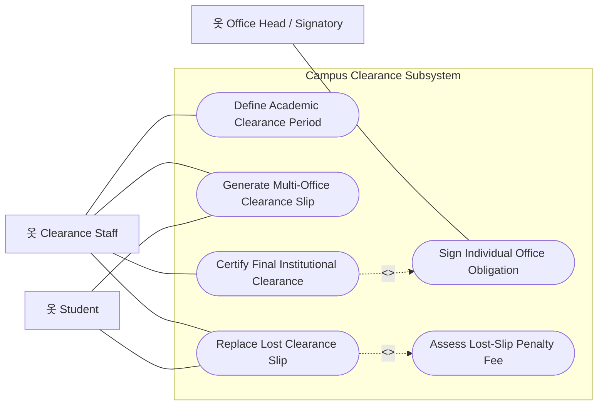

#### Action-Verb Specifications: Clearance Desk

| Use Case ID | Use Case Name (Action-Verb) | Primary Actor | Secondary Actor | Trigger / Goal | Preconditions | Postconditions |
| :--- | :--- | :--- | :--- | :--- | :--- | :--- |
| **UC-CLR-01** | `Define Academic Clearance Period` | Clearance Staff | None | Beginning of semester clearance cycle | Active academic term | Clearance period opened with active office requirement checklist |
| **UC-CLR-02** | `Generate Multi-Office Clearance Slip` | Clearance Staff | Student | Student initiates clearance cycle | Student has active enrollment | Multi-office tracking slip generated with individual signing nodes |
| **UC-CLR-03** | `Sign Individual Office Obligation` | Office Head | Student | Student clears obligations in specific office | Clearance slip active | Specific requirement row signed with timestamp and officer ID |
| **UC-CLR-04** | `Replace Lost Clearance Slip` | Clearance Staff | Student | Student files affidavit/request for lost slip | Existing clearance in `Pending`/`Incomplete` | New replacement clearance slip printed with duplicate watermark |
| **UC-CLR-05** | `Assess Lost-Slip Penalty Fee` | Clearance Staff | Cashier | Lost slip replacement initiated | Replacement requested | ₱100 replacement fee recorded in billing ledger |
| **UC-CLR-06** | `Certify Final Institutional Clearance` | Clearance Staff | Student | All individual office requirements signed | 100% requirements verified | `overallStatus = Cleared`; unblocks final registrar enrollment |

---

### Desk 07: Curriculum Scheduling & Block Assignment Desk

The Scheduling Desk creates block sections, assigns classroom spaces, builds weekly timetable matrices, and allocates cohorts of students to intact blocks.

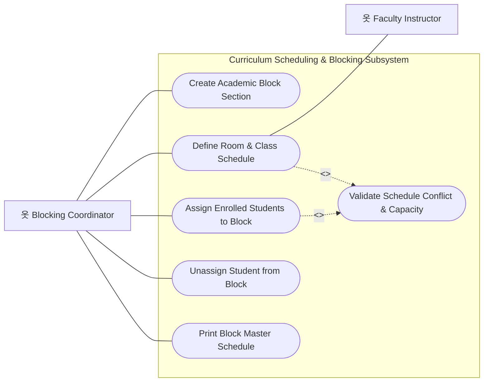

#### Action-Verb Specifications: Blocking Desk

| Use Case ID | Use Case Name (Action-Verb) | Primary Actor | Secondary Actor | Trigger / Goal | Preconditions | Postconditions |
| :--- | :--- | :--- | :--- | :--- | :--- | :--- |
| **UC-BLK-01** | `Create Academic Block Section` | Blocking Coordinator | None | New semester block section needed | Course and term exist | Block section registered with maximum capacity threshold (e.g. 40) |
| **UC-BLK-02** | `Define Room & Class Schedule` | Blocking Coordinator | Instructor | Course offerings assigned to block | Room and instructor catalog active | Schedule timeslots mapped with day, start/end time, and room ID |
| **UC-BLK-03** | `Validate Schedule Conflict & Capacity` | System / Engine | None | Schedule or student block assignment saved | Timetable input supplied | Prevents double-booking of rooms, instructors, and exceeding block caps |
| **UC-BLK-04** | `Assign Enrolled Students to Block` | Blocking Coordinator | None | Regular students assigned to intact schedule | Student evaluated and assessed | Student linked to block section; subject schedules mapped |
| **UC-BLK-05** | `Unassign Student from Block` | Blocking Coordinator | None | Irregular load change or section transfer | Student currently assigned | Student unlinked from block section; seats freed for other students |
| **UC-BLK-06** | `Print Block Master Schedule` | Blocking Coordinator | Instructor | Section schedule published for distribution | Valid block schedule exists | Formatted weekly visual schedule grid generated and printed |

---

### Desk 08: Office of the University Registrar Desk

The Registrar Desk enforces institutional academic compliance, signs final matriculation approvals, and issues certified enrollment credentials.

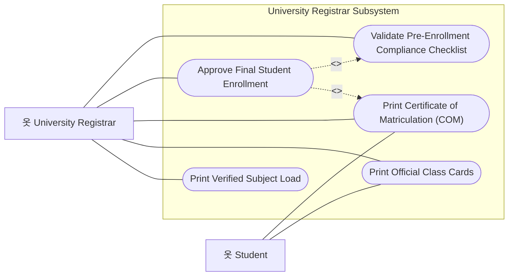

#### Action-Verb Specifications: Registrar Desk

| Use Case ID | Use Case Name (Action-Verb) | Primary Actor | Secondary Actor | Trigger / Goal | Preconditions | Postconditions |
| :--- | :--- | :--- | :--- | :--- | :--- | :--- |
| **UC-REG-01** | `Validate Pre-Enrollment Compliance Checklist` | University Registrar | None | Final enrollment queue opened | Student reached final approval stage | Automated audit of evaluation, assessment, downpayment, and clearance |
| **UC-REG-02** | `Approve Final Student Enrollment` | University Registrar | Student | Compliance checklist 100% verified | Preconditions met | `enrollmentStatus = Enrolled`; student officially registered for term |
| **UC-REG-03** | `Print Certificate of Matriculation` | University Registrar | Student | Official enrollment approved | Student is officially enrolled | High-fidelity Certificate of Matriculation (COM) printed |
| **UC-REG-04** | `Print Official Class Cards` | University Registrar | Student | Student requires proof of class admission | Student is officially enrolled | Individual perforated class cards generated per enrolled subject |
| **UC-REG-05** | `Print Verified Subject Load` | University Registrar | Student | Subject load verification requested | Subject load confirmed | Official summary of subjects and units printed with registrar seal |

---

### Desk 09: Campus Health & Medical Clinic Desk

The Campus Clinic conducts physical fitness screenings, vital sign checks, and registers students under mandatory PhilHealth / Universal Health Care mandates.

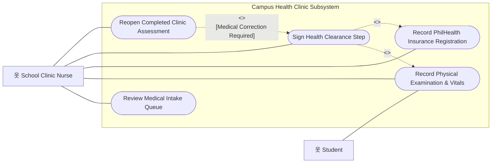

#### Action-Verb Specifications: Clinic Desk

| Use Case ID | Use Case Name (Action-Verb) | Primary Actor | Secondary Actor | Trigger / Goal | Preconditions | Postconditions |
| :--- | :--- | :--- | :--- | :--- | :--- | :--- |
| **UC-MED-01** | `Review Medical Intake Queue` | Clinic Nurse | None | Nurse views scheduled student examinations | Active enrollment exists | Filterable list of students awaiting medical examination |
| **UC-MED-02** | `Record Physical Examination & Vitals` | Clinic Nurse | Student | Student examined at clinic | Medical record loaded | Blood pressure, pulse rate, BMI, visual acuity, and notes recorded |
| **UC-MED-03** | `Record PhilHealth Insurance Registration` | Clinic Nurse | PhilHealth | Student presents PhilHealth PIN / declaration | Clinic assessment active | PhilHealth coverage status and member ID linked to student dossier |
| **UC-MED-04** | `Sign Health Clearance Step` | Clinic Nurse | Student | Vitals normal or certified cleared | Medical evaluation complete | Medical step in `enrollmentworkflow` marked complete |
| **UC-MED-05** | `Reopen Completed Clinic Assessment` | Clinic Nurse | None | Medical update or diagnosis amendment | Record is currently completed | Clinic record unlocked for revision with mandatory audit trail log |

---

### Desk 10: Student ID Validation & Release Desk

The Student ID Office validates ID requests with face-photo capture, signs the final workflow step, and records release of the printed ID cards (cards are printed off-system).

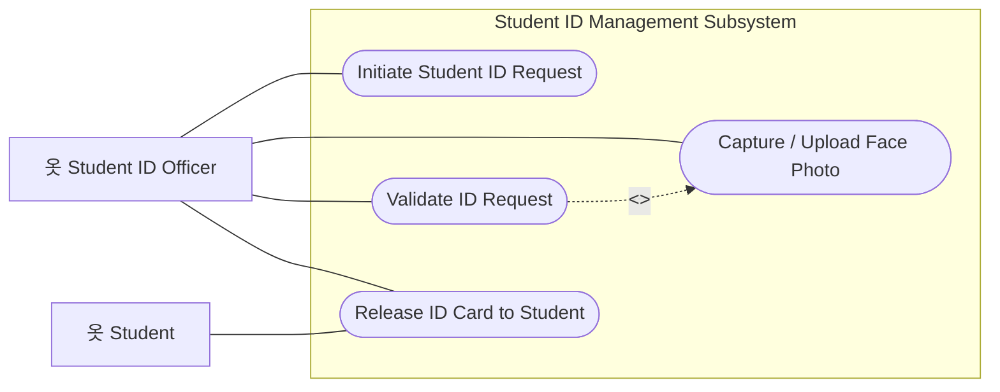

#### Action-Verb Specifications: Student ID Desk

| Use Case ID | Use Case Name (Action-Verb) | Primary Actor | Secondary Actor | Trigger / Goal | Preconditions | Postconditions |
| :--- | :--- | :--- | :--- | :--- | :--- | :--- |
| **UC-IDM-01** | `Initiate Student ID Request` | ID Officer | Student | Student completes official enrollment | Enrollment status is `Enrolled` | ID request created in status `Pending` |
| **UC-IDM-02** | `Capture / Upload Face Photo` | ID Officer | Student | ID request is pending and awaiting validation | Live camera available or photo file on hand | Face photo attached to the ID request |
| **UC-IDM-03** | `Validate ID Request` | ID Officer | None | Request is `Pending` with the face photo attached | Photo attached; workflow at the ID Office step | Request transitioned to `Validated` with validator and timestamp; workflow step signed |
| **UC-IDM-04** | `Release ID Card to Student` | ID Officer | Student | Student presents claim stub at ID counter | Card is in `Validated` status | Release recorded; status `Released` |

---

### Desk 11: Student 360° Digital Dossier & Directory Desk

The Student 360° portal provides unified, cross-department visibility into the complete institutional journey of every student.

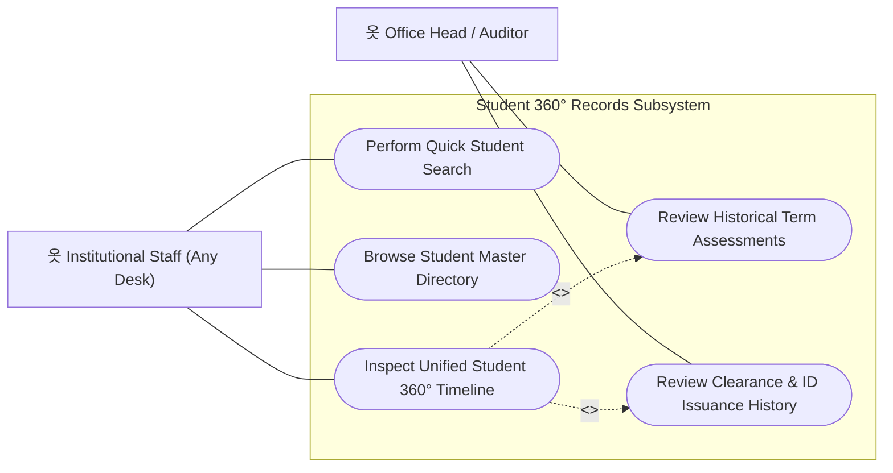

#### Action-Verb Specifications: Student 360° Desk

| Use Case ID | Use Case Name (Action-Verb) | Primary Actor | Secondary Actor | Trigger / Goal | Preconditions | Postconditions |
| :--- | :--- | :--- | :--- | :--- | :--- | :--- |
| **UC-360-01** | `Perform Quick Student Search` | Institutional Staff | None | Staff presses `Ctrl+K` from any screen | Staff is authenticated | Instant search dropdown renders top matching student profiles |
| **UC-360-02** | `Browse Student Master Directory` | Institutional Staff | None | Staff opens master directory index | Permission `students.view` | Filterable, paginated student table rendered by course, term, and year |
| **UC-360-03** | `Inspect Unified Student 360° Timeline` | Institutional Staff | None | Staff selects specific student dossier | Target `studentId` exists | Segmented 5-tab dossier rendered with live status indicators |
| **UC-360-04** | `Review Historical Term Assessments` | Office Head | None | Auditor verifies multi-year tuition balances | Accessing student 360 dossier | Complete breakdown of past assessments, discounts, and receipts shown |
| **UC-360-05** | `Review Clearance & ID Issuance History` | Office Head | None | Investigating student standing or ID release history | Accessing student 360 dossier | Historical clearance periods and ID issuance log displayed |

---

### Desk 12: System Administration, Security & Audit Desk

The System Administration Desk manages staff security accounts, role-based access control (RBAC), institutional reference catalogs, and immutable security audit logs.

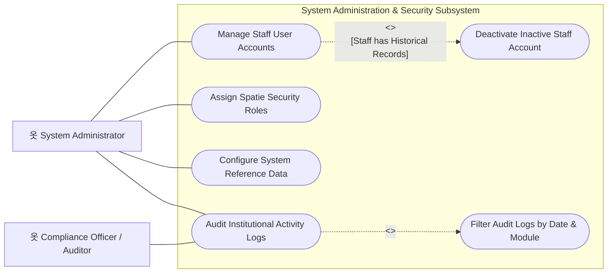

#### Action-Verb Specifications: Administration Desk

| Use Case ID | Use Case Name (Action-Verb) | Primary Actor | Secondary Actor | Trigger / Goal | Preconditions | Postconditions |
| :--- | :--- | :--- | :--- | :--- | :--- | :--- |
| **UC-ADM-01** | `Manage Staff User Accounts` | System Administrator | None | New staff hired or responsibilities updated | User has `user.create`/`user.update` | User account created, modified, or password reset |
| **UC-ADM-02** | `Assign Spatie Security Roles` | System Administrator | Target Staff | Staff assigned to specific desk (e.g. Cashier) | User account exists | Spatie roles/permissions synced; explicit audit log created |
| **UC-ADM-03** | `Configure System Reference Data` | System Administrator | None | New academic curriculum, fee, or room added | Permission `refdata.view`/manage | Courses, terms, fee types, rooms, and blocks updated |
| **UC-ADM-04** | `Audit Institutional Activity Logs` | System Administrator | Compliance Auditor | Investigating system event or security review | Permission `audit.view` | Chronological immutable log rendered with redaction of passwords |
| **UC-ADM-05** | `Deactivate Inactive Staff Account` | System Administrator | None | Staff deletion requested but FK records exist | Staff has historical evaluations/approvals | Account marked `Inactive` preserving database integrity |
| **UC-ADM-06** | `Filter Audit Logs by Date & Module` | Compliance Auditor | None | Narrowing audit search to specific incident | Audit log viewer opened | Filtered event list displayed with actor IP address and before/after payloads |

---

## 5. Formal Use Case Specifications (Deep-Dive Templates)

Below are three representative **full-lifecycle Use Case Specifications** documented to enterprise standards.

---

### Specification 1: UC-ADM-04 (Approve Admission Application)

```
================================================================================
USE CASE SPECIFICATION: UC-ADM-04
================================================================================
Use Case ID:       UC-ADM-04
Use Case Name:     Approve Admission Application
Scope:             SEAIT Enrollment Management System — Admissions Subsystem
Level:             User-Goal / Business Process
Primary Actor:     Admission Officer
Secondary Actors:  Applicant, System State Machine
Trigger:           Admission Officer reviews a fully verified applicant and clicks "Approve Admission".

Preconditions:
  1. Admission Officer is authenticated with Spatie permission 'admission.approve'.
  2. The target admission record is in status 'UnderReview'.
  3. All mandatory admission requirements (e.g. Form 138, PSA Birth Certificate, Good Moral) 
     are verified in the database.
  4. The applicant has taken the General Entrance Exam and recorded a passing score (BR9).

Main Success Scenario (MSS):
  1. Admission Officer opens the Admission Workstation for the applicant.
  2. System displays the applicant dossier, verified documents checklist, and exam passing score.
  3. Admission Officer clicks the high-contrast "Approve Admission" action button.
  4. System prompts for final confirmation with cause-and-effect summary.
  5. Admission Officer confirms approval.
  6. System begins a database transaction:
     a. Updates admissions.admissionStatus = 'Approved'.
     b. Records evaluatedBy = Auth::user()->userId and evaluatedDate = now().
     c. <<include>> Instantiates a new Enrollments record (SM-1) with studentId, courseId, 
        termId, yearLevel = 1, and enrollmentStatus = 'Pending'.
     d. Writes an immutable entry to auditlogs with event 'admission.approved'.
  7. System commits database transaction.
  8. System redirects with success notification: "Admission approved and student moved to Evaluation queue."

Extensions / Alternate Flows:
  3a. Mandatory requirements are incomplete:
      .1 System disables the "Approve" button and renders an alert banner specifying missing documents.
      .2 Use case ends in failure.
  3b. Applicant failed or did not take the General Entrance Exam:
      .1 System AdmissionPolicy denies authorization (HTTP 403 Forbidden).
      .2 Toast notification alerts officer: "Cannot approve: General Entrance Exam not passed."
      .3 Use case ends in failure.
  6a. Database transaction failure:
      .1 System rolls back all database mutations.
      .2 System renders error message: "Failed to commit approval. Please try again."
      .3 Use case ends in failure.

Postconditions (Guarantees):
  - Success: Admission status is 'Approved'. A linked enrollment record exists in 'Pending' status. 
             The student automatically appears in the Academic Department Evaluation queue.
  - Failure: No changes are made to admission or enrollment tables. Audit log records the error.
================================================================================
```

---

### Specification 2: UC-ACC-02 (Post Student Payment Transaction)

```
================================================================================
USE CASE SPECIFICATION: UC-ACC-02
================================================================================
Use Case ID:       UC-ACC-02
Use Case Name:     Post Student Payment Transaction
Scope:             SEAIT Enrollment Management System — Accounting Subsystem
Level:             User-Goal / Financial Transaction
Primary Actor:     Cashier / Accounting Staff
Secondary Actors:  Student / Payer
Trigger:           Student presents payment tender at the cashier window.

Preconditions:
  1. Cashier is authenticated with Spatie permission 'payment.record'.
  2. The student has a finalized financial assessment (studentassessments.status = 'Finalized').
  3. The assessment has a remaining balance > 0.

Main Success Scenario (MSS):
  1. Cashier searches student by School ID Number (useFormKeyboardNav auto-focuses cursor).
  2. System renders the student's itemized charges, total assessed, and outstanding balance.
  3. Cashier inputs Payment Amount, Payment Mode (Cash/Cheque/Bank Transfer), Reference/OR Number.
  4. Cashier presses Enter to advance fields and Ctrl+Enter to submit payment.
  5. System begins database transaction:
     a. Validates that payment amount > 0 and does not exceed remaining balance + tolerance.
     b. Inserts row into payments with paymentStatus = 'Paid', collectedBy = Auth::user()->userId.
     c. Recalculates assessment: remainingBalance = max(0, totalAssessed - scholarships - totalPaid).
     d. If remaining balance reaches 0:
        - Updates enrollmentStatus = 'Paid' via EnrollmentStateMachine.
     e. If remaining balance > 0 but payment satisfies downpayment threshold (BR14):
        - Flags payment as installment compliant for Registrar gating.
     f. Generates immutable audit log entry with cashier ID, OR number, and amount.
  6. System commits database transaction.
  7. <<include>> System generates printable Official Receipt (OR) modal.
  8. Cashier hands printed receipt and stamped assessment to student.

Extensions / Alternate Flows:
  5a. Submitted amount exceeds total outstanding balance:
      .1 System returns validation exception: "Payment amount cannot exceed remaining balance."
      .2 Transaction aborted; no payment saved.
  5b. Duplicate Official Receipt (OR) number entered:
      .1 System prevents duplicate entry via unique database constraint.
      .2 System displays: "OR Number already exists in records."

Postconditions (Guarantees):
  - Success: Payment is committed to ledger. Assessment remaining balance is decremented. 
             Enrollment state is updated. Official receipt is printable.
  - Failure: Assessment balance remains untouched. No phantom receipts are generated.
================================================================================
```

---

### Specification 3: UC-REG-02 (Approve Final Student Enrollment)

```
================================================================================
USE CASE SPECIFICATION: UC-REG-02
================================================================================
Use Case ID:       UC-REG-02
Use Case Name:     Approve Final Student Enrollment
Scope:             SEAIT Enrollment Management System — Registrar Subsystem
Level:             User-Goal / Official Credentialing
Primary Actor:     University Registrar Officer
Secondary Actors:  Student
Trigger:           Registrar reviews a student in the final enrollment queue and issues official registration.

Preconditions:
  1. Registrar is authenticated with Spatie permission 'enrollment.approve'.
  2. Student enrollment record is in status 'Paid' or holds an approved installment downpayment.
  3. <<include>> UC-REG-01 (Validate Pre-Enrollment Compliance Checklist) evaluates to 100% PASS:
     - Academic Evaluation is signed by Department Head.
     - Financial Assessment is finalized.
     - Tuition payment or downpayment is posted.
     - Student holds zero blocking academic obligations.

Main Success Scenario (MSS):
  1. Registrar opens the Registrar Workstation for the student.
  2. System executes compliance checklist engine and renders 4 green verification badges.
  3. Registrar clicks "Approve & Enroll Student".
  4. System prompts for final confirmation.
  5. Registrar confirms approval.
  6. System executes atomic transaction:
     a. Transitions enrollmentStatus = 'Enrolled' via EnrollmentStateMachine.
     b. Sets registrarProcessedBy = Auth::user()->userId, enrolledDate = now().
     c. Generates unique institutional Certificate of Matriculation (COM) serial token.
     d. Writes audit log entry: 'enrollment.approved'.
  7. System commits transaction.
  8. System renders immediate one-click print actions:
     - "Print Certificate of Matriculation"
     - "Print Official Class Cards"
     - "Print Verified Subject Load"
  9. Registrar prints credentials and stamps official university seal.

Extensions / Alternate Flows:
  2a. Compliance checklist has unfulfilled conditions:
      .1 System renders amber/red warning cards detailing the unfulfilled desk requirement.
      .2 The "Approve" button is locked.
      .3 Registrar refers student back to the relevant desk.

Postconditions (Guarantees):
  - Success: Student is officially enrolled in institutional rolls. All class cards are active. 
             Student 360 reflects 'Enrolled' status. ID office queue receives student badge request.
  - Failure: Student status remains unchanged. No academic certificates are issued.
================================================================================
```

---

## 6. Quality Assurance Checklist & Anti-Patterns to Avoid

### 6.1 The 10-Point Use Case Quality Audit

Before submitting or defending a Use Case Diagram, verify every item against this checklist:

- [x] **1. Action-Verb Naming:** Every use case begins with a transitive verb (e.g., `Record`, `Approve`, `Compute`, `Post`).
- [x] **2. Actor Outside Boundary:** No human actor or external system icon is drawn inside the system boundary box.
- [x] **3. Business Value Criterion:** Every use case delivers measurable value to an actor (e.g., `Approve Admission` delivers status, not trivial sub-actions like `Click Button`).
- [x] **4. Proper Arrow Direction for `<<include>>`:** Arrows point from the **base** use case TO the **included** use case ($Base \rightarrow Included$).
- [x] **5. Proper Arrow Direction for `<<extend>>`:** Arrows point from the **extending** use case TO the **base** use case ($Extending \rightarrow Base$).
- [x] **6. Extension Point Defined:** Every `<<extend>>` relationship includes a clear condition note (e.g., `[Applicant is Transferee]`).
- [x] **7. No Orphaned Use Cases:** Every use case connects either to an actor, to another use case via `<<include>>`/`<<extend>>`, or via generalization.
- [x] **8. No Direct Use-Case-to-Use-Case Associations:** Use cases NEVER connect to each other with plain solid lines; only `<<include>>`, `<<extend>>`, or `Generalization` are valid.
- [x] **9. No Functional Decomposition Sprawl:** Avoid breaking a single screen into 10 micro use cases (e.g. `Enter First Name`, `Enter Last Name`, `Click Save`). Combine these into `Record New Applicant`.
- [x] **10. Traceable to Real Code:** Every use case maps cleanly to concrete controller routes, policies, and database state transitions.

---

### 6.2 Common Anti-Patterns to Avoid

```
❌ ANTI-PATTERN 1: The Noun Trap
( Admission ) -------- ( Evaluation ) -------- ( Payment )
PROBLEM: Nouns describe entities, not behavior. Plain associations between use cases violate UML.

✅ REMEDIATION:
( Record New Applicant )
( Propose Subject Load )
( Post Payment Transaction )
```

```
❌ ANTI-PATTERN 2: Reverse Include/Extend Arrows
( Validate Login ) ----<<include>>----> ( Submit Form )
PROBLEM: Arrow is reversed. The form includes the validation, not the other way around.

✅ REMEDIATION:
( Submit Form ) --------<<include>>----> ( Validate Credentials )
```

```
❌ ANTI-PATTERN 3: The Infinite CRUD Sprawl
( Create Student )
( Read Student )
( Update Student )
( Delete Student )
PROBLEM: Clutters diagram with standard database operations.

✅ REMEDIATION:
Combine into a cohesive, goal-driven Use Case:
( Manage Student Records )
```

---

*End of Document. Maintained by SEAIT Software Engineering & Architecture Team.*
